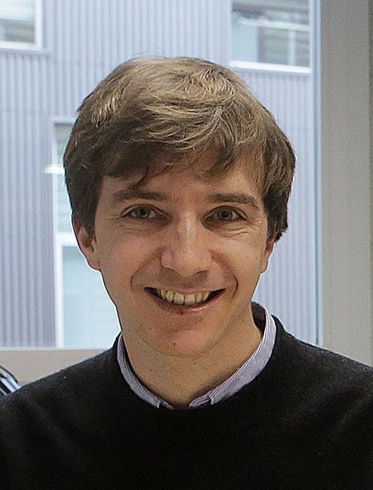
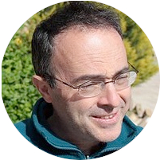

 [**Raffaello Bianco**](https://scholar.google.com/citations?user=YtXgXCAAAAAJ&hl=it) – Materials Physics Center, San Sebastian, Spain

> Postdoctoral researcher at the [*Materials Physics Center*](https://cfm.ehu.es/eu/) .
>
>**e-mail:** raffaello.bianco@ehu.eus

 [**Matteo Calandra**](https://mcalandra.github.io/) – University of Trento, Trento, Italy

> Full Professor at the [*University of Trento*](https://www.unitn.it/) and CNRS Research Director at [*Sorbonne Université*](https://www.sorbonne-universite.fr/) .
>
>**e-mail:** m.calandrabuonaura@unitn.it

 [**Ion Errea**](https://ionerrea.wordpress.com/) – University of the Basque Country, San Sebastian, Spain

> Professor at the University of the Basque Country (UPV/EHU), leader of the *Quantum Theory of Materials* group at the [*Materials Physics Center*](https://cfm.ehu.es/eu/), and associated researcher at the [*Donostia International Physics Center*](http://dipc.ehu.es/index.php) .
>
>**e-mail:** ion.errea@ehu.eus

 [**Francesco Mauri**](http://www2.phys.uniroma1.it/doc/mauri/) – Università di Roma La Sapienza, Rome, Italy

> Full Professor at the [*Università di Roma La Sapienza*](https://www.uniroma1.it/en/pagina-strutturale/home) .
>
>**e-mail:** francesco.mauri@uniroma1.it

 [**Lorenzo Monacelli**](www.lafisicadimonacelli.it) – Università di Roma La Sapienza, Rome, Italy

> Postdoctoral researcher at [*Università di Roma La Sapienza*](https://www.uniroma1.it/en/pagina-strutturale/home) .
>
>**e-mail:** lorenzo.monacelli@roma1.infn.it
 
