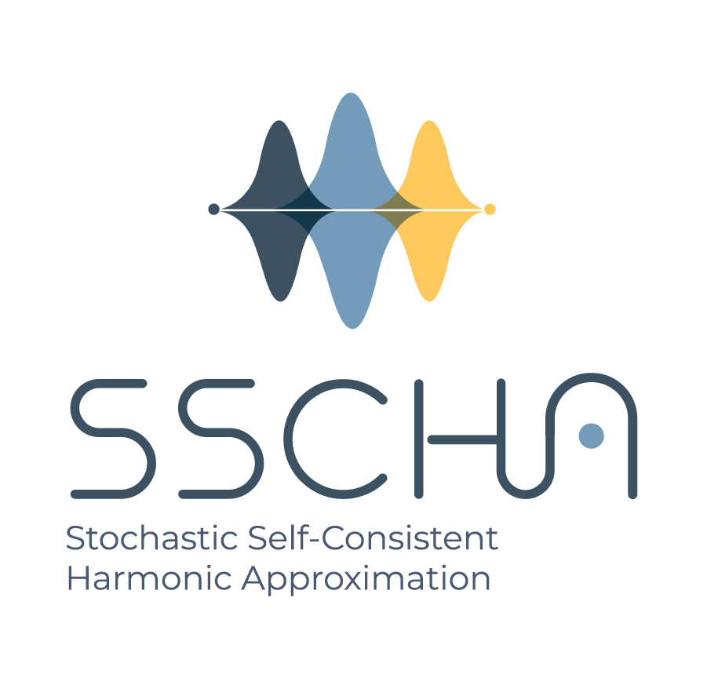

The stochastic self-consistent harmonic approximation (SSCHA) is a full computational python package that simulates thermodynamic and phononic properties of materials accounting for anharmonicity at a nonperturbative level that  fully including quantum and thermal fluctuations.

If you are simulating transport or thermal properties of materials, phase diagrams, or phonon-related properties, then you need the SSCHA code. The method is based on a full-quantum variational method that optimizes the nuclear wave-functions (or density matrix at finite temperature) to minimize the free energy. In this way it can be used to calculate thermodynamic properties of strongly anharmonic systems and the conditions at which first- and second-order phases occur, estimate the phonon frequencies expected experimentally, obtain spectral functions, phonon lifetimes, determine the structural changes imposed by quantum effects, and so on.  

The SSCHA comes both as a python library that can be runned inside your own workflows and as a stand-alone software, which is initialized by input files with the same syntax as Quantum ESPRESSO. It can be coupled with any *ab initio* engine for force and energy calculations, or it can also be used with force fields. It can interact through the Atomic Simulation Environment (ASE), and has an implemented interface for automatic submission of jobs in a remote cluster.

In this website you can find the instructions to install the code and tutorials that will help you understand how to use it.
